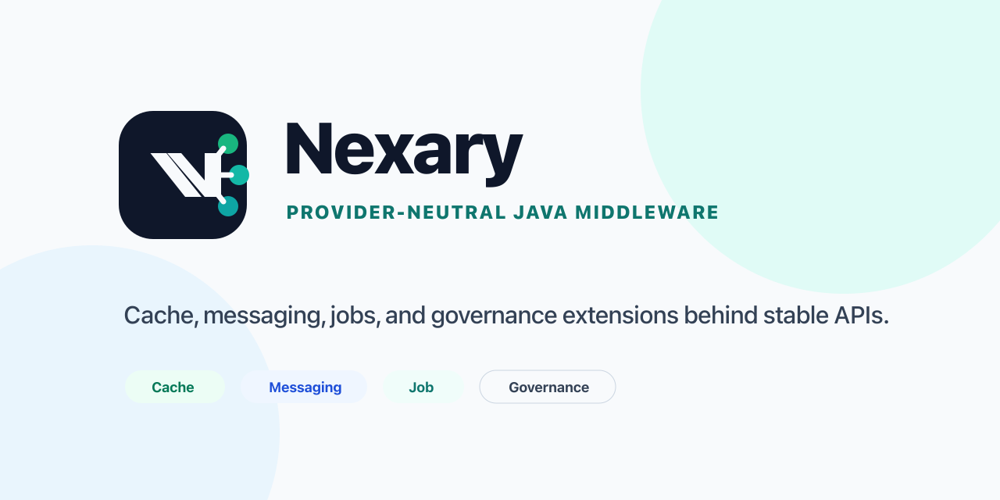

# Nexary

<p align="center">
  
</p>

英文镜像文档：[README.en.md](README.en.md)

[](https://github.com/lxil520/nexary/actions/workflows/build.yml)
[](LICENSE)
[](README.md)
[](README.md)

**让业务专注业务，让中间件保持可替换。**

Nexary 用稳定的 provider-neutral API，把缓存、消息、任务调度和可观测性能力从业务代码中解耦出来。团队可以先把精力放在产品和业务增长上；当 Redis、Kafka、RocketMQ、XXL-JOB 等基础设施需要升级、替换或绕开瓶颈时，迁移成本尽量收敛在框架适配层，而不是散落到业务系统的每个角落。

当前 `0.2.x` 以 Spring Boot 3.3 / Java 17+ 为主线，聚焦缓存、消息、任务调度、SPI、可观测性桥接，以及后续服务治理能力需要的基础扩展点；Spring Boot 2.7 / Java 8+ 与 Spring Boot 4.1 / Java 21 按能力提供已验证入口。

## 适用场景

- 正在维护多个 Spring Boot 服务，希望缓存、消息和任务调度不要把业务代码绑死在某个中间件 SDK 上的团队。
- 需要在 Redis、Kafka、RocketMQ、XXL-JOB 等基础设施之间保留替换空间，但又不想在应用层复制一套复杂平台的开发者。
- 想要一个小而清晰的 Java middleware facade：公共 API 稳定，provider 适配留在框架层，示例和本地验证可直接运行。

## 10 分钟体验路径

```bash
git clone https://github.com/lxil520/nexary.git
cd nexary
./gradlew :nexary-samples:nexary-sample-cache:run
./gradlew :nexary-samples:nexary-sample-messaging:run
./gradlew :nexary-samples:nexary-sample-job:run
```

如果你只想看真实中间件联调，直接运行：

```bash
./scripts/middleware/up.sh
./scripts/middleware/smoke.sh
./scripts/middleware/run-integration-tests.sh
```

## 当前状态

Nexary 仍处于 `1.0.0` 之前阶段。公共 API 会尽量保持小而稳定，具体实现模块在 `1.0.0` 前仍可能继续调整。

当前已验证主线：

- Spring Boot 3.3 / Java 17+ 主线，覆盖 Cache、Messaging、Job 和 observation bridge
- Spring Boot 2.7 / Java 8+ 的 Cache Redis 单级缓存入口，覆盖 `nexary-cache-spring-boot2-starter`
- Spring Boot 2.7 / Java 8+ 的 Messaging Redis-only 入口，覆盖 `nexary-messaging-spring-boot2-starter`
- Spring Boot 2.7 / Java 8+ 的 Job 入口，覆盖 `nexary-job-spring-boot2-starter`
- Spring Boot 4.1 / Java 21 主验证运行时的 Cache Redis 入口，覆盖 `nexary-cache-spring-boot4-starter`
- Spring Boot 4.1 / Java 21 主验证运行时的 Messaging provider-by-provider 入口，覆盖 `nexary-messaging-spring-boot4-starter` 加一个 Boot4 provider artifact
- Spring Boot 4.1 / Java 21 主验证运行时的 Job 受限边界入口，覆盖 `nexary-job-spring-boot4-starter`

这个边界来自 Spring Boot 3 自身的 Java 17+ 要求，不是因为 Nexary 最初用 Java 17 开发。

为了扩大使用人群，Nexary 把 Spring Boot 2.7 / Java 8+ 和 Spring Boot 4.1 / Java 21 纳入 `0.2.x` 兼容目标。兼容支持不能只靠 README 声明，必须通过独立 starter、依赖版本锁定、样例和 CI 验收后再标记为支持。当前文档中的依赖片段只代表已经验收的组合。Java 21 是 Nexary 对 Boot4 线的主验证运行时，不代表 Spring Boot 4 的官方最低 JDK；官方最低 JDK 仍以 Spring 官方文档为准。

## 文档入口

- 文档切换页：[docs/README.md](docs/README.md)
- 中文文档：[docs/zh/index.md](docs/zh/index.md)
- English docs: [docs/en/index.md](docs/en/index.md)

按能力阅读：

- 配置手册：[docs/zh/configuration.md](docs/zh/configuration.md)
- Cache：[docs/zh/cache.md](docs/zh/cache.md)
- Messaging：[docs/zh/messaging.md](docs/zh/messaging.md)
- Job：[docs/zh/job.md](docs/zh/job.md)
- 本地验证：[docs/zh/verification.md](docs/zh/verification.md)

通用说明：

- 架构说明：[docs/zh/architecture.md](docs/zh/architecture.md)
- 编码规范：[docs/zh/standards.md](docs/zh/standards.md)
- 贡献与维护流程：[docs/zh/collaboration.md](docs/zh/collaboration.md)
- 版本路线图：[docs/zh/roadmap.md](docs/zh/roadmap.md)
- 发布清单：[docs/zh/release.md](docs/zh/release.md)

## 模块结构

- `nexary-framework/nexary-core`：deadline、traffic tag、retry、fault、observation 等基础语义
- `nexary-framework/nexary-spi`：基于 `ServiceLoader` 的 SPI 注册与组合查询
- `nexary-cache/nexary-cache-api`：统一缓存 API，覆盖 TTL、batch、cache-aside、分布式锁和 atomic counter 抽象
- `nexary-cache/nexary-cache-redis`：Redis 适配实现与 Spring Boot 自动配置，支持内部 Caffeine L1 的多级缓存模式
- `nexary-messaging/nexary-messaging-api`：统一消息 envelope、publisher、consumer、serializer、retry、dead-letter、interceptor、重复消费保护 API
- `nexary-messaging/nexary-messaging-disruptor`：基于官方 LMAX Disruptor 的进程内 ring-buffer 队列
- `nexary-messaging/nexary-messaging-kafka`：基于 Spring `kafkaTemplate` 的 Kafka 适配层
- `nexary-messaging/nexary-messaging-redis`：基于 Redis List 的轻量队列适配层，默认关闭，按需启用
- `nexary-messaging/nexary-messaging-rocketmq`：基于 Spring `rocketMQTemplate` 的 RocketMQ 适配层
- `nexary-job/nexary-job-api`：任务、调度、执行上下文、执行 ID、执行记录、执行策略和监听器 API
- `nexary-job/nexary-job-scheduler`：本地 `TaskScheduler` 调度器，可选接入 cache 单实例锁、worker topology、分片和执行生命周期
- `nexary-job/nexary-job-xxljob`：XXL-JOB bridge，复用统一执行生命周期
- `nexary-boot/nexary-bom`：依赖约束
- `nexary-boot/nexary-*-spring-boot-starter`：Starter 聚合模块
- `nexary-samples`：按能力拆开的 starter / SPI 参考工程

## 从哪里开始

### 1. 先看能力入口，再决定从哪条线接入

- 只关心缓存：先看 [nexary-cache/README.md](nexary-cache/README.md)
- 只关心消息：先看 [nexary-messaging/README.md](nexary-messaging/README.md)
- 只关心任务：先看 [nexary-job/README.md](nexary-job/README.md)
- 只关心本地验证：先看 [docs/zh/verification.md](docs/zh/verification.md)

### 2. 运行按能力拆开的参考工程

```bash
./gradlew :nexary-samples:nexary-sample-cache:run
./gradlew :nexary-samples:nexary-sample-messaging:run
./gradlew :nexary-samples:nexary-sample-job:run
```

样例说明不再只列接口，而是明确每个样例应该复制什么到业务工程，见 [nexary-samples/README.md](nexary-samples/README.md)。

### 3. 再接入真实中间件

本仓库已经提供本地 Docker 联调脚本，可直接验证 Redis、Kafka、RocketMQ、MySQL、XXL-JOB Admin：

```bash
./scripts/middleware/up.sh
./scripts/middleware/smoke.sh
./scripts/middleware/run-integration-tests.sh
```

## 在 Spring Boot 项目中接入

### 1. 先选择 Nexary 版本

Nexary 当前还没有发布到 Maven Central 的正式版本。现在只能使用本地构建出来的 `0.2.0-SNAPSHOT`：

```bash
./gradlew publishToMavenLocal
```

正式发布后，用户可以按两种方式选择版本：

- 使用 Maven Central 显示的 Latest Version。
- 使用 GitHub Releases / Tags 中的版本号，例如 `v0.2.0` 对应依赖版本 `0.2.0`。

不要把 `main` 分支提交号或未发布的 `0.2.0-SNAPSHOT` 当作生产依赖版本。

### 2. 再按 Spring Boot / JDK 选择入口

| Spring Boot | JDK | 状态 | 版本选择 | BOM | Starter artifactId |
| --- | --- | --- | --- | --- | --- |
| Spring Boot 3.3 | Java 17+ | 当前已验证 | `0.2.0-SNAPSHOT` 本地验证；正式发布后使用 Latest Version 或 tag 版本 | `nexary-bom` | `nexary-cache-spring-boot-starter`<br>`nexary-messaging-spring-boot-starter`<br>`nexary-job-spring-boot-starter`<br>`nexary-observation-micrometer-spring-boot-starter` |
| Spring Boot 2.7 | Java 8+ | Cache Redis 单级缓存已验证；Messaging Redis-only 已验证；Job 受限边界已验证 | `0.2.0-SNAPSHOT` 本地验证；正式发布后使用 Latest Version 或 tag 版本 | 当前入口使用直接版本；专用 BOM 另行发布时再切换 | 已验证：`nexary-cache-spring-boot2-starter`<br>已验证：`nexary-messaging-spring-boot2-starter`<br>已验证：`nexary-job-spring-boot2-starter` |
| Spring Boot 4.1 | Java 21 主验证运行时 | Cache Redis 已验证；Messaging provider-by-provider 已验证；Job 受限边界已验证；不是全仓库 Boot4 支持 | `0.2.0-SNAPSHOT` 本地验证；正式发布后使用 Latest Version 或 tag 版本 | 当前入口使用直接版本；专用 BOM 另行发布时再切换 | 已验证：`nexary-cache-spring-boot4-starter`<br>已验证：`nexary-messaging-spring-boot4-starter` 加一个 Boot4 provider artifact<br>已验证：`nexary-job-spring-boot4-starter` |

只有“已验证”的 artifactId 可以直接复制下面的依赖片段。当前还没有 Maven Central 正式版本，生产项目应等待 release 版本。

### 3. Spring Boot 3.3 / Java 17+：Maven

先引入 BOM，再按能力选择 starter：

```xml
<properties>
  <!-- 当前只能本地使用 0.2.0-SNAPSHOT；正式发布后替换为 Maven Central Latest Version 或 tag 版本。 -->
  <nexary.version>0.2.0-SNAPSHOT</nexary.version>
</properties>

<dependencyManagement>
  <dependencies>
    <dependency>
      <groupId>org.nexary</groupId>
      <artifactId>nexary-bom</artifactId>
      <version>${nexary.version}</version>
      <type>pom</type>
      <scope>import</scope>
    </dependency>
  </dependencies>
</dependencyManagement>

<dependencies>
  <!-- 缓存能力：CacheClient、分布式锁、atomic counter、Redis provider 自动配置。 -->
  <dependency>
    <groupId>org.nexary</groupId>
    <artifactId>nexary-cache-spring-boot-starter</artifactId>
  </dependency>
  <!-- 消息能力：统一 publisher/consumer API，provider 通过配置选择。 -->
  <dependency>
    <groupId>org.nexary</groupId>
    <artifactId>nexary-messaging-spring-boot-starter</artifactId>
  </dependency>
  <!-- 任务能力：统一 job API、本地 scheduler、XXL-JOB bridge 扩展点。 -->
  <dependency>
    <groupId>org.nexary</groupId>
    <artifactId>nexary-job-spring-boot-starter</artifactId>
  </dependency>
  <!-- 可选：Micrometer observation bridge。 -->
  <dependency>
    <groupId>org.nexary</groupId>
    <artifactId>nexary-observation-micrometer-spring-boot-starter</artifactId>
  </dependency>
</dependencies>
```

### 4. Spring Boot 3.3 / Java 17+：Gradle

```groovy
// 当前只能本地使用 0.2.0-SNAPSHOT；正式发布后替换为 Maven Central Latest Version 或 tag 版本。
def nexaryVersion = "0.2.0-SNAPSHOT"

dependencies {
    // 使用 BOM 锁定 Nexary 各模块版本；正式发布后把 nexaryVersion 设置为 Latest Version 或 tag 版本。
    implementation platform("org.nexary:nexary-bom:${nexaryVersion}")

    // Starter 模式：按能力引入，业务代码只依赖 Nexary API，不直接依赖底层中间件 SDK。
    implementation 'org.nexary:nexary-cache-spring-boot-starter'
    implementation 'org.nexary:nexary-messaging-spring-boot-starter'
    implementation 'org.nexary:nexary-job-spring-boot-starter'

    // 可选：把 Nexary observation event 接到 Micrometer。
    implementation 'org.nexary:nexary-observation-micrometer-spring-boot-starter'
}
```

### 5. Spring Boot 2.7 / Java 8+：Cache Redis 单级缓存

当前 Boot2 只验证了 Cache Redis 单级缓存入口。它不包含 tiered local cache；如果显式设置 `nexary.cache.redis.tiered-enabled=true`，Boot2 starter 会快速失败并提示该路径尚未支持。

Maven：

```xml
<dependencies>
  <dependency>
    <groupId>org.nexary</groupId>
    <artifactId>nexary-cache-spring-boot2-starter</artifactId>
    <version>0.2.0-SNAPSHOT</version>
  </dependency>
</dependencies>
```

Gradle：

```groovy
dependencies {
    implementation 'org.nexary:nexary-cache-spring-boot2-starter:0.2.0-SNAPSHOT'
}
```

推荐配置：

```yaml
nexary:
  cache:
    redis:
      tiered-enabled: false
```

### 6. Spring Boot 2.7 / Java 8+：Messaging Redis-only

当前 Boot2 Messaging 只验证了 Redis-only provider/starter。Disruptor、Kafka、RocketMQ 的 Boot2/JDK8 入口仍待独立验证。

Maven：

```xml
<dependencies>
  <dependency>
    <groupId>org.nexary</groupId>
    <artifactId>nexary-messaging-spring-boot2-starter</artifactId>
    <version>0.2.0-SNAPSHOT</version>
  </dependency>
</dependencies>
```

Gradle：

```groovy
dependencies {
    implementation 'org.nexary:nexary-messaging-spring-boot2-starter:0.2.0-SNAPSHOT'
}
```

推荐配置：

```yaml
nexary:
  messaging:
    provider: redis
    redis:
      enabled: true
```

### 7. Spring Boot 2.7 / Java 8+：Job

当前 Boot2 Job 验证了 provider-neutral Job API、本地 scheduler、XXL-JOB bridge 入口，以及可选 Redis completed-record execution store。这个入口不声明真实 XXL-JOB Admin 调度、executor 注册生命周期、回调生命周期、平台触发执行、PowerJob、分布式调度控制面或 exactly-once 执行。

Maven：

```xml
<dependencies>
  <dependency>
    <groupId>org.nexary</groupId>
    <artifactId>nexary-job-spring-boot2-starter</artifactId>
    <version>0.2.0-SNAPSHOT</version>
  </dependency>
</dependencies>
```

Gradle：

```groovy
dependencies {
    implementation 'org.nexary:nexary-job-spring-boot2-starter:0.2.0-SNAPSHOT'
}
```

可选 Redis completed-record store：

```yaml
nexary:
  job:
    execution:
      store:
        redis:
          enabled: true
          retention: 1d
```

### 8. Spring Boot 4.1 / Java 21：Cache

Boot4 Cache 当前验证 Redis provider/starter。这里不声明整个仓库都已完成 Boot4 支持，也不声明 Java 21 是 Spring Boot 4 官方最低 JDK。

```groovy
dependencies {
    implementation 'org.nexary:nexary-cache-spring-boot4-starter:0.2.0-SNAPSHOT'
}
```

```xml
<dependencies>
  <dependency>
    <groupId>org.nexary</groupId>
    <artifactId>nexary-cache-spring-boot4-starter</artifactId>
    <version>0.2.0-SNAPSHOT</version>
  </dependency>
</dependencies>
```

### 9. Spring Boot 4.1 / Java 21：Messaging

Boot4 Messaging 不提供“聚合所有 provider”的 starter。先引入 provider-neutral starter，再选择恰好一个 Boot4 provider artifact。下面是 Redis provider 示例，可直接复制使用。

```groovy
dependencies {
    implementation 'org.nexary:nexary-messaging-spring-boot4-starter:0.2.0-SNAPSHOT'
    runtimeOnly 'org.nexary:nexary-messaging-redis-boot4:0.2.0-SNAPSHOT'
}
```

```xml
<dependencies>
  <dependency>
    <groupId>org.nexary</groupId>
    <artifactId>nexary-messaging-spring-boot4-starter</artifactId>
    <version>0.2.0-SNAPSHOT</version>
  </dependency>
  <dependency>
    <groupId>org.nexary</groupId>
    <artifactId>nexary-messaging-redis-boot4</artifactId>
    <version>0.2.0-SNAPSHOT</version>
    <scope>runtime</scope>
  </dependency>
</dependencies>
```

Boot4 Messaging provider 选择：

| Provider | Gradle runtime artifactId | Maven runtime artifactId |
| --- | --- | --- |
| Disruptor | `nexary-messaging-disruptor-boot4` | `nexary-messaging-disruptor-boot4` |
| Redis | `nexary-messaging-redis-boot4` | `nexary-messaging-redis-boot4` |
| Kafka | `nexary-messaging-kafka-boot4` | `nexary-messaging-kafka-boot4` |
| RocketMQ | `nexary-messaging-rocketmq-boot4` | `nexary-messaging-rocketmq-boot4` |

### 10. Spring Boot 4.1 / Java 21：Job

Boot4 Job 当前验证 provider-neutral Job API、本地 scheduler、XXL-JOB bridge-shaped 入口，以及可选 Redis completed-record execution store。不声明真实 XXL-JOB Admin 调度、executor 注册生命周期、回调生命周期、平台触发执行、PowerJob、分布式调度控制面或 exactly-once 执行。

```groovy
dependencies {
    implementation 'org.nexary:nexary-job-spring-boot4-starter:0.2.0-SNAPSHOT'
}
```

```xml
<dependencies>
  <dependency>
    <groupId>org.nexary</groupId>
    <artifactId>nexary-job-spring-boot4-starter</artifactId>
    <version>0.2.0-SNAPSHOT</version>
  </dependency>
</dependencies>
```

### 11. SPI/provider 依赖模式

如果不用 starter，也可以使用 SPI/provider 依赖模式。业务代码仍只依赖 Nexary API，provider 通过运行时依赖和 `nexary.*` 配置选择：

```groovy
// 当前只能本地使用 0.2.0-SNAPSHOT；正式发布后替换为 Maven Central Latest Version 或 tag 版本。
def nexaryVersion = "0.2.0-SNAPSHOT"

dependencies {
    implementation platform("org.nexary:nexary-bom:${nexaryVersion}")

    // 业务编译期只依赖 Nexary API。
    implementation 'org.nexary:nexary-messaging-api'

    // Boot3 / Java17+：这里选择 Kafka provider。
    runtimeOnly 'org.nexary:nexary-messaging-kafka'
}
```

Boot3 / Java17+ 的 Messaging provider 运行时依赖可替换为 `nexary-messaging-disruptor`、`nexary-messaging-redis`、`nexary-messaging-kafka` 或 `nexary-messaging-rocketmq` 中的一个。切换 provider 时只调整依赖和 `nexary.*` 配置，不改业务发送/消费代码。

Boot2 / Java8+ 的 Messaging SPI/provider 当前只验证 Redis-only：

```groovy
dependencies {
    implementation 'org.nexary:nexary-messaging-api:0.2.0-SNAPSHOT'
    runtimeOnly 'org.nexary:nexary-messaging-redis-boot2:0.2.0-SNAPSHOT'
}
```

Boot2 / Java8+ 的 Job SPI/provider 当前验证本地 scheduler、XXL-JOB bridge 和 Redis completed-record store。只需要本地调度时使用下面这段：

```groovy
dependencies {
    implementation 'org.nexary:nexary-job-api:0.2.0-SNAPSHOT'
    runtimeOnly 'org.nexary:nexary-job-scheduler-spring-boot2:0.2.0-SNAPSHOT'
}
```

需要 XXL-JOB bridge 或 Redis completed-record store 时，再分别加入：

```groovy
dependencies {
    runtimeOnly 'org.nexary:nexary-job-xxljob-spring-boot2:0.2.0-SNAPSHOT'
    runtimeOnly 'org.nexary:nexary-job-execution-store-redis-spring-boot2:0.2.0-SNAPSHOT'
}
```

Boot4 / Java21 主验证运行时的 Messaging SPI/provider 按 provider 独立引入。下面是 Redis provider 示例：

```groovy
dependencies {
    implementation 'org.nexary:nexary-messaging-api:0.2.0-SNAPSHOT'
    runtimeOnly 'org.nexary:nexary-messaging-redis-boot4:0.2.0-SNAPSHOT'
}
```

Boot4 / Java21 主验证运行时的 Messaging provider artifactId：`nexary-messaging-disruptor-boot4`、`nexary-messaging-redis-boot4`、`nexary-messaging-kafka-boot4`、`nexary-messaging-rocketmq-boot4`。每个服务默认只选择一个。

Boot4 / Java21 主验证运行时的 Job SPI/provider 本地调度示例：

```groovy
dependencies {
    implementation 'org.nexary:nexary-job-api:0.2.0-SNAPSHOT'
    runtimeOnly 'org.nexary:nexary-job-scheduler-spring-boot4:0.2.0-SNAPSHOT'
}
```

需要 XXL-JOB bridge 或 Redis completed-record store 时，再分别加入：

```groovy
dependencies {
    runtimeOnly 'org.nexary:nexary-job-xxljob-spring-boot4:0.2.0-SNAPSHOT'
    runtimeOnly 'org.nexary:nexary-job-execution-store-redis-spring-boot4:0.2.0-SNAPSHOT'
}
```

当前建议是每个服务只启用一个出站消息 provider。若同一服务要同时路由 Kafka 和 RocketMQ，由应用层显式封装自己的路由 facade，比在框架层做隐式选择更清晰。

## 发布与版本策略

- 发布到 Maven Central 前，先完成 namespace 校验、签名、SCM 元数据和 sources/javadoc 产物
- 先把 `0.2.x` 主线和发布流程打稳，同时逐项推进 Spring Boot 2.7 / Java 8+ 与 Spring Boot 4.1 / Java 21 能力入口
- Spring Boot 2 / JDK 8 支持走独立 provider / starter 线，不污染当前 Boot3 主线 API
- Spring Boot 4.1 / Java 21 支持走独立 Boot4 provider / starter 线；Messaging 不发布聚合所有 provider 的 Boot4 starter

详细说明见 [docs/zh/release.md](docs/zh/release.md) 和 [docs/zh/roadmap.md](docs/zh/roadmap.md)。

## 贡献与维护

Nexary 按能力维护：

- Cache、Messaging、Job 先保持清晰边界，各自拥有独立样例、测试和文档。
- 本地验证统一通过 Docker、smoke、integration tests 和 `publishToMavenLocal` 收口。
- 治理能力在范围清楚后再独立成模块，避免过早污染当前主线 API。
- 公开讨论使用 GitHub issue / PR；内部任务记录不作为用户文档入口。

## 开发验证

```bash
./gradlew check
./gradlew publishToMavenLocal
```
