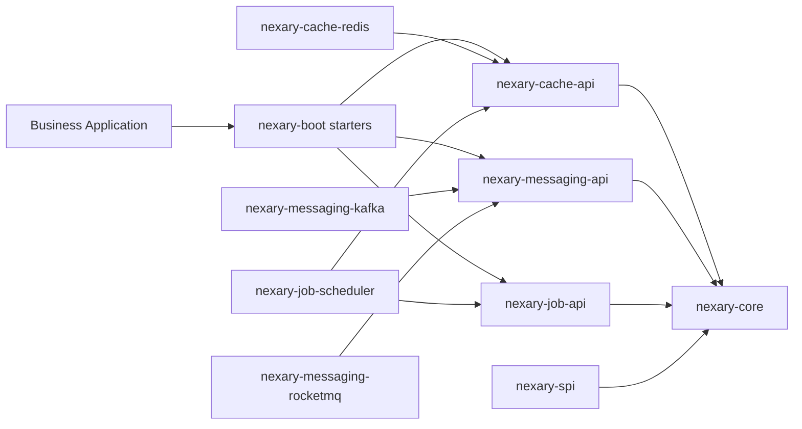
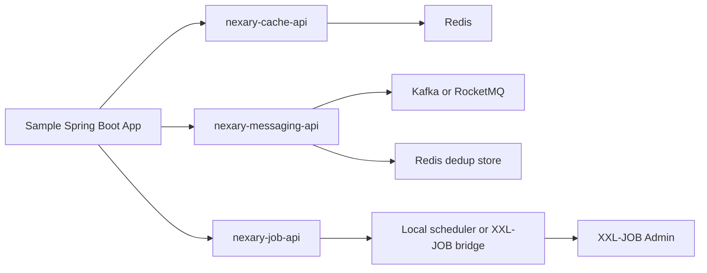
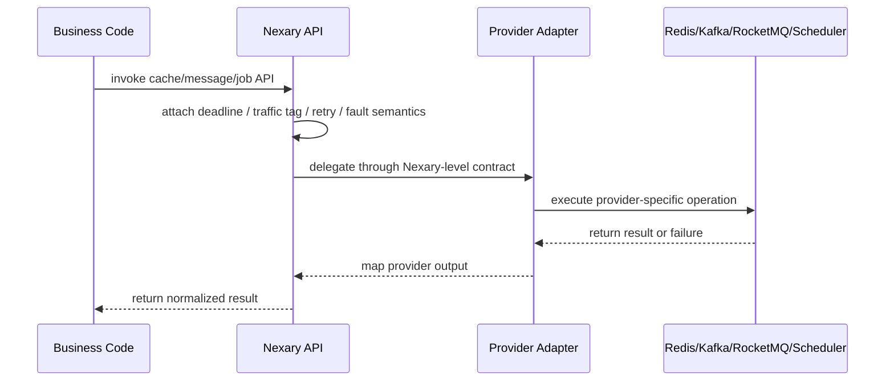

# Architecture

Nexary follows a layered design: Nexary-level APIs at the center, provider-specific adapters around them, and Spring Boot starters on the outside.

## Design Principles

- Keep public APIs small and stable.
- Keep Redis, Kafka, and RocketMQ native types out of public API modules.
- Let starters assemble implementations without forcing applications to depend on every provider.
- Normalize resilience signals early: deadline, traffic tag, retry, fault, and observation.
- Define compatibility through documented public APIs; implementation modules may continue to evolve before 1.0.

## Module Topology



## Deployment Views

| Shape | Best For | Components |
| --- | --- | --- |
| Quickstart | first API walkthrough | demo cache + demo publisher + local scheduler |
| Local infra | local integration | Redis cache, Kafka or RocketMQ, local scheduler or XXL-JOB bridge |
| Production-like | near-production validation | Redis tiered cache, one primary messaging provider, dedup store, job-platform bridge |

The `0.1.x` boundary is explicit: a business service should normally activate one outbound messaging provider. The framework should not make hidden Kafka versus RocketMQ routing choices inside starters.

## Dependency Direction

```text
nexary-framework
  -> no project dependencies

nexary-cache/nexary-cache-api
  -> nexary-framework/nexary-core

nexary-cache/nexary-cache-redis
  -> nexary-cache/nexary-cache-api

nexary-messaging/nexary-messaging-api
  -> nexary-framework/nexary-core

nexary-messaging/provider adapters
  -> nexary-messaging/nexary-messaging-api

nexary-job/nexary-job-api
  -> nexary-framework/nexary-core

nexary-job/nexary-job-scheduler
  -> nexary-job/nexary-job-api
  -> nexary-cache/nexary-cache-api

nexary-boot starters
  -> aggregate API and adapter modules
```

API modules must not depend on implementation modules. Starters should only aggregate dependencies and auto-configuration.

## Typical Local Integration Topology



## Execution Flow



## Governance Primitives

- `DeadlineContext`: request deadline propagation.
- `TrafficTag`: online/offline, priority, tenant, and business key tagging.
- `RetrySignal`: explicit retry or stop-retry feedback.
- `FaultSignal`: normalized timeout, rejection, rate limit, degradation, and downstream error signals.
- `NexaryObservationEvent`: common event shape for future metrics and tracing.

## Current Architectural Conclusions

- Redis is the primary cache implementation in `0.1.x`, with an optional internal Caffeine L1 that is not exposed as a public peer backend.
- Kafka, RocketMQ, Redis queue, and Disruptor all sit behind the same messaging abstractions, but samples and applications should still make the provider choice explicit.
- XXL-JOB is currently a bridge, not a second public scheduling API. Business code should continue to target `NexaryJob`.
- Heavier governance features such as bulkheads, rate limits, and unified telemetry export should land in later versions instead of bloating the initial API surface.
