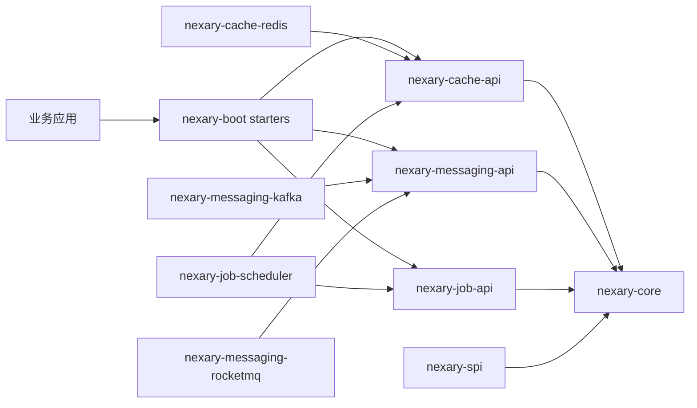
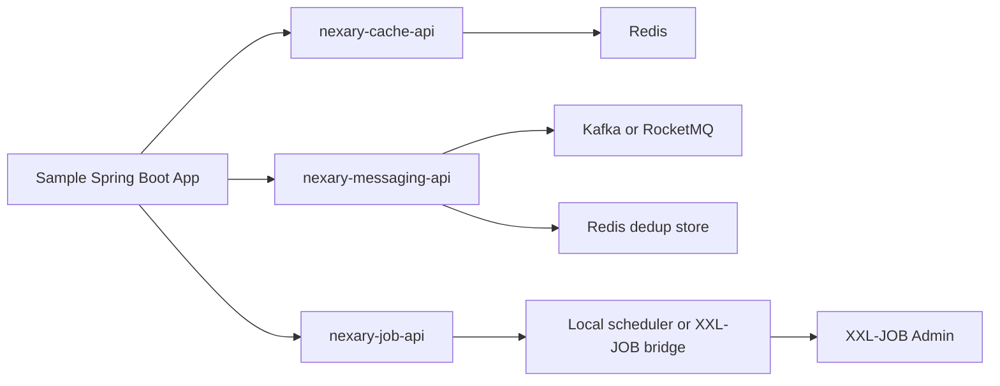
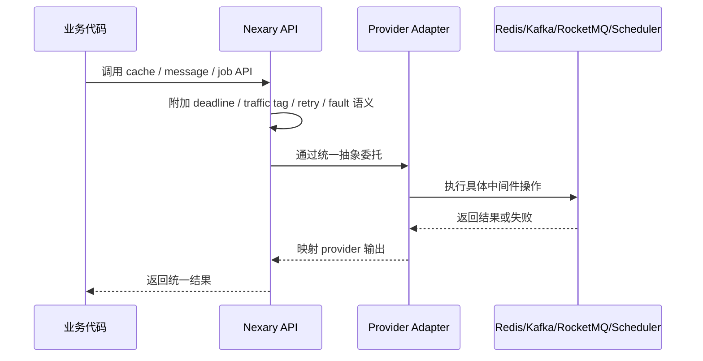

# 架构说明

Nexary 采用分层设计：中间是 provider-neutral API，外围是具体适配器，再往外是 Spring Boot Starter。

## 设计原则

- 公共 API 保持小而稳定。
- Redis、Kafka、RocketMQ 的原生类型不进入公共 API 模块。
- Starter 负责组装能力，不强迫业务工程依赖所有 provider。
- 尽早统一治理语义：deadline、traffic tag、retry、fault、observation。
- 不承诺与任何历史内部实现兼容。

## 模块拓扑



## 部署视图

| 形态 | 适用阶段 | 组成 |
| --- | --- | --- |
| Quickstart | 第一次体验 API | demo cache + demo publisher + local scheduler |
| Local infra | 本地联调 | Redis cache、Kafka 或 RocketMQ、local scheduler 或 XXL-JOB bridge |
| Production-like | 接近生产验证 | Redis tiered cache、单一主消息 provider、去重存储、作业平台桥接 |

`0.1.x` 的边界很明确：一个业务服务默认只启用一个出站消息 provider。框架不在 starter 层偷偷帮用户做 Kafka / RocketMQ 路由决策。

## 依赖方向

```text
nexary-framework
  -> 不依赖其他项目模块

nexary-cache/nexary-cache-api
  -> nexary-framework/nexary-core

nexary-cache/nexary-cache-redis
  -> nexary-cache/nexary-cache-api

nexary-messaging/nexary-messaging-api
  -> nexary-framework/nexary-core

nexary-messaging/provider adapters
  -> nexary-messaging/nexary-messaging-api

nexary-job/nexary-job-api
  -> nexary-framework/nexary-core

nexary-job/nexary-job-scheduler
  -> nexary-job/nexary-job-api
  -> nexary-cache/nexary-cache-api

nexary-boot starters
  -> 聚合 API 和适配器模块
```

API 模块不能反向依赖实现模块。Starter 只负责聚合依赖和自动配置。

## 典型本地联调拓扑



## 调用流程



## 治理基础语义

- `DeadlineContext`：请求截止时间传递。
- `TrafficTag`：online/offline、priority、tenant、bizKey 标签。
- `RetrySignal`：显式表达继续重试或停止重试。
- `FaultSignal`：统一超时、拒绝、限流、降级、下游异常信号。
- `NexaryObservationEvent`：统一观测事件模型，方便后续接指标与 trace。

## 当前架构结论

- Redis 是 `0.1.x` 的主缓存实现，内部可选 Caffeine L1，但 Caffeine 不是公开后端类型。
- Kafka、RocketMQ、Redis queue、Disruptor 都接入统一消息抽象，但样例和应用层仍应明确自己选哪个 provider。
- XXL-JOB 当前是 bridge，而不是新的调度 API。业务仍面向 `NexaryJob`。
- 更重的服务治理能力，例如 bulkhead、rate limit、统一观测导出，应放到后续版本单独收敛，而不是现在把主线 API 做胖。
